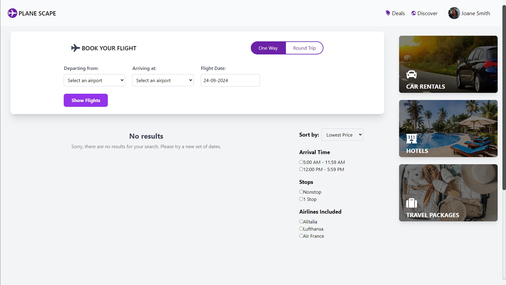
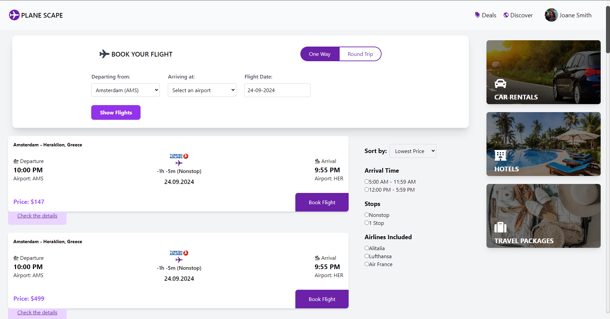
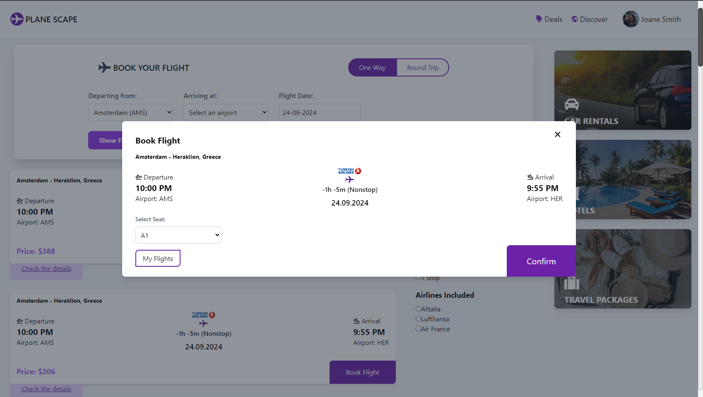
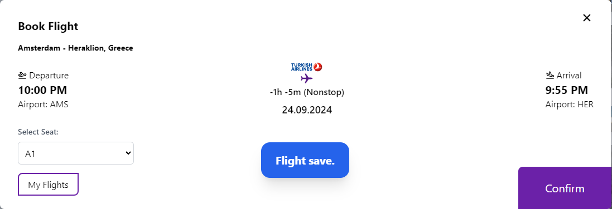
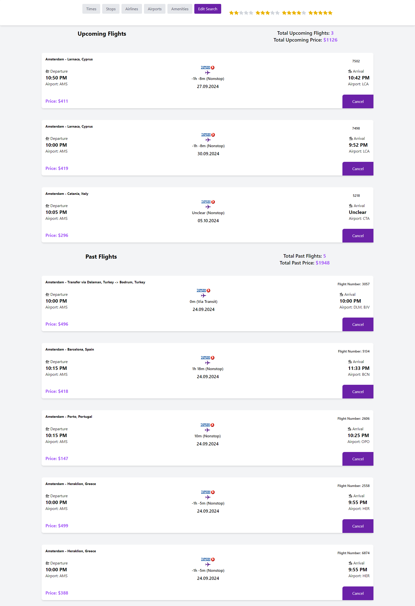
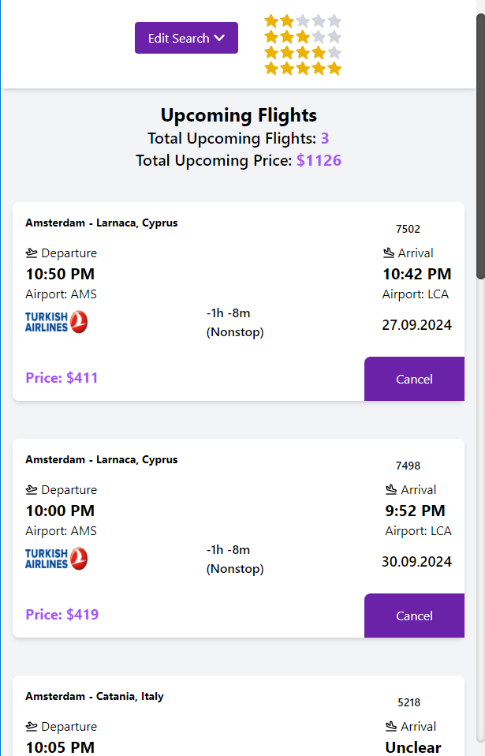
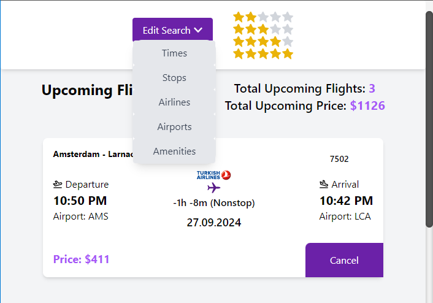

# Flight Booking Application

This project is a simple web application where flights are listed using the Schiphol airport API, and users can make flight reservations. The project is developed using React for the frontend and Node.js with MongoDB for the backend.

## Table of Contents
- [About the Project](#about-the-project)
- [Features](#features)
- [Minimum Requirements](#minimum-requirements)
- [Installation](#installation)
- [Usage](#usage)
- [Screenshots](#screenshots)
- [Developer Notes](#developer-notes)

---

## About the Project
This application is designed to display flight information, filter by dates and directions, allow users to book flights, list users' previous flights, and show total price information. The project aims to provide a simple and modern design.

### Technologies Used:
- **React** (Frontend)
- **Node.js** (Backend)
- **MongoDB** (Database)
- **Tailwind CSS**: Styling is done using a simple, modern structure.

---

## Features
1. List flights using the Schiphol API.
2. Filter flights by date and direction.
3. Users can make flight reservations and view their flights in chronological order.
4. Restrictions on booking past flights.
5. Users can view the total cost of their flights.

---

## Minimum Requirements
- **Node.js**: 16.x or higher
- **pnpm**: Required for package management

---

## Installation

Follow these steps to set up and run the project:

1. **Clone the repository**:
    ```bash
    git clone https://github.com/Omer-KISAKOL/flight-booking.git
    cd flight-booking
    ```

2. **Install frontend dependencies**:
    ```bash
    cd frontend
    pnpm install
    ```

3. **Install backend dependencies**:
    ```bash
    cd backend
    pnpm install
    ```

4. **Start the backend**:
    ```bash
    cd backend
    node index.js
    ```

5. **Start the frontend**:
    ```bash
    cd frontend
    pnpm run dev
    ```

---

## Usage

1. **Flight Filtering**: Filter flights by date and direction.
2. **Flight List**: Flights pulled from the API are listed on the homepage.
3. **Making Reservations**: Select a flight to make a reservation and save it to MongoDB.
4. **My Flights**: View all flights belonging to the user.

---

## Screenshots

### Homepage






### My Flights Page




---

## Developer Notes

- **Flight times**: There are some issues with the data returned by the API, resulting in "-" values for the time difference calculation.

### Styling:
- **CSS**: Style files are organized to maintain a clean and modern structure. Tailwind CSS framework has been used externally.
- **Responsive Design**: The page is developed with a flexible structure to be mobile-friendly.

### Future Improvements:
- Additional **filtering options** for flight information can be added.
- **User login/logout** functionality can be integrated.
- **Animations and visual enhancements** can be applied.


---

---

# Uçuş Rezervasyon Uygulaması

Bu proje, Schiphol havalimanı API'sini kullanarak uçuşların listelendiği ve kullanıcıların uçuş rezervasyonu yapabileceği basit bir web uygulamasıdır. Proje React ile frontend, Node.js ve MongoDB ile backend geliştirilmiştir.

## İçindekiler
- [Proje Hakkında](#proje-hakkında)
- [Özellikler](#özellikler)
- [Minimum Gereksinimler](#minimum-gereksinimler)
- [Kurulum](#kurulum)
- [Kullanım](#kullanım)
- [Ekran Görüntüleri](#ekran-görüntüleri)
- [Geliştirici Notları](#geliştirici-notları)

---

## Proje Hakkında
Bu uygulama, uçuş bilgilerini görüntülemek, tarih ve yönlere göre filtrelemek, rezervasyon yapmak, kullanıcıların önceki uçuşlarını listelemek ve toplam fiyat bilgisini göstermek için tasarlanmıştır. Proje, sade ve modern bir tasarım sunmayı hedeflemiştir.

### Kullanılan Teknolojiler:
- **React** (Frontend)
- **Node.js** (Backend)
- **MongoDB** (Veritabanı)
- **Tailwind CSS**: Stil düzenlemeleri sade, modern bir yapı kullanılarak yapılmıştır.

---

## Özellikler
1. Schiphol API'si kullanılarak uçuşlar listelenir.
2. Uçuşlar tarih ve yönlere göre filtrelenebilir.
3. Kullanıcı uçuş rezervasyonu yapabilir ve uçuşlarını kronolojik sıra ile görüntüleyebilir.
4. Geçmiş tarihli uçuşlar için rezervasyon kısıtlaması bulunur.
5. Kullanıcı uçuşlarının toplam tutarlarını görüntüleyebilir.

---

## Minimum Gereksinimler
- **Node.js**: 16.x ve üzeri
- **pnpm**: Paket yönetimi için gerekli.

---

## Kurulum

Projeyi çalıştırmak için aşağıdaki adımları takip edin:

1. **Depoyu klonlayın**:
    ```bash
    git clone https://github.com/Omer-KISAKOL/flight-booking.git
    cd flight-booking
    ```

2. **Frontend için gerekli bağımlılıkları yükleyin**:
    ```bash
    cd frontend
    pnpm install
    ```
   
3. **Backend için gerekli bağımlılıkları yükleyin**:
    ```bash
    cd backend
    pnpm install
    ```

4. **Backend'i başlatın**:
    ```bash
    cd backend
    node index.js
    ```

5. **Frontend'i başlatın**:
    ```bash
    cd frontend
    pnpm run dev
    ```

---

## Kullanım

1. **Uçuş Filtreleme**: Tarih ve hareket yönüne göre uçuşları filtreleyebilirsiniz.
2. **Uçuş Listesi**: Anasayfada API'den çekilen uçuş bilgileri listelenir.
3. **Rezervasyon Yapma**: Uçuş seçerek rezervasyon yapabilir ve MongoDB'ye kaydedebilirsiniz.
4. **Uçuşlarım**: Kullanıcıya ait tüm uçuşlar görüntülenir.

---

## Ekran Görüntüleri

### Anasayfa


### Uçuşlarım Sayfası


---

## Geliştirici Notları

- **Uçuş saatleri**: API dan gelen veriler ile ilgili problem olduğundan aradaki zaman hesabı "-" li değerler alabiliyor.

### Stil Yönetimi:
- **CSS**: Stil dosyaları sade, modern bir yapıya sahip olacak şekilde düzenlenmiştir. Harici olarak Tailwind css kütüphanesi kullanılmıştır.
- **Responsive Tasarım**: Sayfa mobil uyumlu olacak şekilde esnek yapıda geliştirilmiştir.

### Gelecekteki Geliştirmeler:
- **Uçuş bilgileri için ek filtreleme seçenekleri** eklenebilir.
- **Kullanıcı giriş/çıkış** sistemi eklenebilir.
- **Animasyonlar ve görsel iyileştirmeler** uygulanabilir.